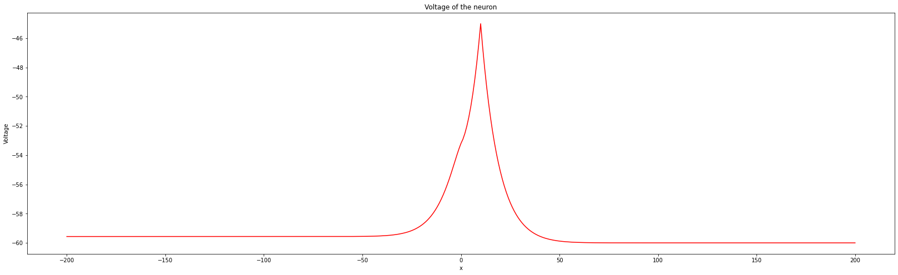
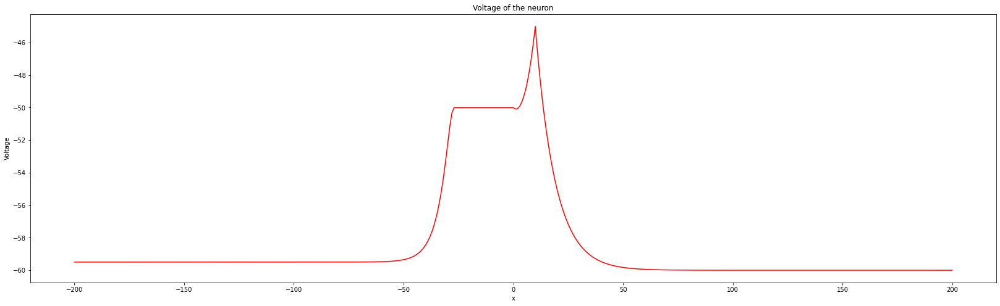
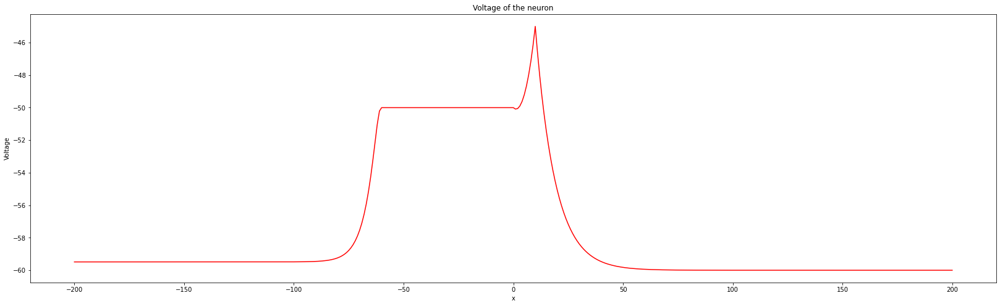

# EIF-Neuron

This is a simulation of a neuron using the Exponential Integrate and Fire model, this is a differential equation which integrates the current incident to the axon of a neuron and spikes the voltage exponentially when a threshold voltage is exceeded.

I used this in my one dimensional spiking neuron model which spikes when enough current is incident to the axon, it then sends a voltage spike down the axon.

I did this as the project of my Maths Masters degree.

Here is a series of graphs from the simulation of the neuron:

The y - axis in voltage and the x - axis is the dimension along the cell. The left hand side of the cell (the x - axis) is the axon and the right hand side is the dendrite

The dendrite has current injected into it. The current moves through the dendrite and into the axon, the axon spikes when it reaches a threshold voltage it spikes exponentially and propagates a voltage spike through it by a 'chain reaction'.

### The current is injected initially into the dendrite.

### The voltage diffuses into the axon. generating a voltage spike which travels through the axon.

### The voltage spoke travels even farther through the axon.
